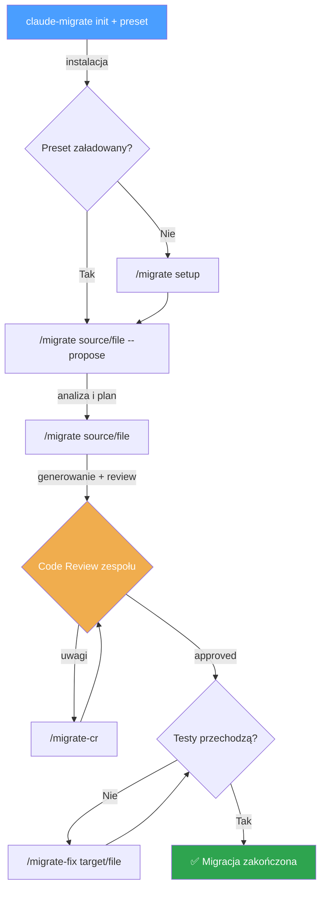

# @odyseusz426/claude-migrate

Rozszerzenie SDD Framework — uniwersalny toolkit migracji dla Claude Code.

## Wymagania

- `@odyseusz426/claude-npm-sdd` zainstalowany i zainicjalizowany (`sdd init`)

## Instalacja

```bash
# Skonfiguruj registry (jednorazowo)
echo "@odyseusz426:registry=https://npm.pkg.github.com" >> ~/.npmrc

# Zainstaluj globalnie
npm i -g @odyseusz426/claude-migrate
```

## Użycie

```bash
# W katalogu projektu (po sdd init):
claude-migrate init                             # kopiuje agentów i komendy
claude-migrate preset cypress-to-playwright     # ładuje preset technologiczny
claude-migrate preset cypress-to-playwright --update  # aktualizuje do najnowszej wersji
claude-migrate presets                          # lista dostępnych presetów
claude-migrate --version                        # wersja paczki
```

## Po instalacji

1. Załaduj preset lub skonfiguruj ręcznie:
```bash
# Opcja A: gotowy preset
claude-migrate preset cypress-to-playwright

# Opcja B: interaktywna konfiguracja (w Claude Code)
/migrate setup
```

2. Skonfiguruj repozytoria:
```bash
sdd dirs add ../source-repo        # repo źródłowe
sdd dirs add ../target-repo        # repo docelowe
sdd dirs add ../reference-repo     # repo referencyjne (opcjonalne)
```

## Komendy

| Komenda | Cel |
|---------|-----|
| `/migrate setup` | Konfiguracja migracji — preset lub ręczna definicja reguł |
| `/migrate preset-create` | Tworzenie nowego presetu na podstawie analizy repozytoriów |
| `/migrate` | Migracja pliku (analiza + generowanie + review) |
| `/migrate-cr` | Poprawki po Code Review |
| `/migrate-fix` | Debug i naprawa failujących testów |

## Agenci

| Agent | Rola | Model |
|-------|------|-------|
| `migration-writer` | Generowanie kodu docelowego | sonnet |
| `migration-supervisor` | Review kompletności i spójności | opus |
| `migration-cr` | Poprawki po Code Review | sonnet |

## Presety

| Preset | Opis |
|--------|------|
| `cypress-to-playwright` | Migracja testów Cypress → Playwright (API tests) |

Presety zawierają reguły, mapowania wzorców i konwencje specyficzne dla pary technologii.

### Tworzenie własnego presetu

```
/migrate preset-create jest-to-vitest --source ../jest-app --target ../vitest-app
```

Komenda przeanalizuje oba repozytoria, rozpozna wzorce i wygeneruje preset. Brakujące informacje dopyta interaktywnie.

## Flow migracji



## Licencja

MIT
